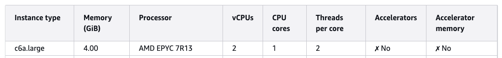

# Deploy Sample Application
To deploy the 2048 game sample application, in the same terminal window run the following command:

```bash
kubectl apply -f 2048_full.yaml
```

This creates/updates four resources that together deploy the 2048 web application and expose it to the internet via an AWS ALB.

### Monitor the Application
To see Auto Mode in action, we can monitor the nodes and pods in separate terminal windows. We can watch the nodes go from `No resources found` to `NotReady` and then `Ready` as the request is made.

```bash
kubectl get nodes -w

NAME                  STATUS     ROLES    AGE   VERSION
i-0579304fc41fb401f   NotReady   <none>   0s    v1.34.2-eks-b3126f4
i-0579304fc41fb401f   Ready      <none>   1s    v1.34.2-eks-b3126f4
```

We can also watch the pods in the `game-2048` namespace go from `Pending` to `ContainerCreating` to `Running` for the 5 pods requested.

```bash
kubectl get pods -n game-2048 -w

NAME                               READY   STATUS    RESTARTS   AGE
deployment-2048-7bf64bccb7-j4kbr   0/1     Pending   0          0s
deployment-2048-7bf64bccb7-5fwhm   0/1     Pending   0          0s
deployment-2048-7bf64bccb7-wwkk8   0/1     Pending   0          0s
deployment-2048-7bf64bccb7-cq6dz   0/1     Pending   0          0s
deployment-2048-7bf64bccb7-hdwjc   0/1     Pending   0          0s
deployment-2048-7bf64bccb7-hdwjc   0/1     ContainerCreating   0          19s
deployment-2048-7bf64bccb7-j4kbr   0/1     ContainerCreating   0          19s
deployment-2048-7bf64bccb7-5fwhm   0/1     ContainerCreating   0          19s
deployment-2048-7bf64bccb7-wwkk8   0/1     ContainerCreating   0          19s
deployment-2048-7bf64bccb7-cq6dz   0/1     ContainerCreating   0          19s
deployment-2048-7bf64bccb7-hdwjc   1/1     Running             0          26s
deployment-2048-7bf64bccb7-j4kbr   1/1     Running             0          26s
deployment-2048-7bf64bccb7-5fwhm   1/1     Running             0          26s
deployment-2048-7bf64bccb7-wwkk8   1/1     Running             0          27s
deployment-2048-7bf64bccb7-cq6dz   1/1     Running             0          27s
```

Next we want to get the ALB configuration for the ingress. We can do this by running the following command.

```bash
kubectl get ingress -n game-2048
```

The response will show the ADDRESS which is the public DNS name of the ALB that has been created.

```bash
NAME           CLASS   HOSTS   ADDRESS                                                                    PORTS   AGE
ingress-2048   alb     *       k8s-game2048-ingress2-d14358e9b2-2110109076.eu-west-2.elb.amazonaws.com   80      31s
```

It will take a few minutes for the load balancer to be provisioned and the listeners and target groups set up. Once complete, you can enter the DNS name into a browser window and start playing the game.


### Check config in the AWS Console
We can also go into the AWS Console and look at what has been setup in the EKS cluster as well as the ALB.

We can click through the Amazon EKS tabs in the console and see the deployment that has been created.


We can see the ReplicaSet created that has a pod count of 5.


We can also view the 5 running pods.


These have all been deployed on a single general purpose node.


The node has an instance type of `c6a.large`. The `c` instance family type is one of the 3 instance family types supported by the `general-purpose` node pool as we saw in a previous section.

## How many pods can I run on a node?
A common question is how many pods you can actually run on a given node. With EKS Auto Mode this is less important as you no longer need to worry about pod density and Auto Mode will automatically provision nodes and select instance types. However, it's still interesting to understand how this is calculated.

We can view the capacity allocation for a given EKS node in the AWS console.


This diagram shows capacity allocation across cores, memory and pods. We can get more information about the node by using the following command to describe it.

```bash
kubectl describe node i-0579304fc41fb401f

...
Addresses:
  InternalIP:   10.1.4.110
  InternalDNS:  ip-10-1-4-203.eu-west-2.compute.internal
  Hostname:     ip-10-1-4-203.eu-west-2.compute.internal
Capacity:
  cpu:                2
  ephemeral-storage:  81854Mi
  hugepages-1Gi:      0
  hugepages-2Mi:      0
  memory:             3881108Ki
  pods:               27
Allocatable:
  cpu:                1780m
  ephemeral-storage:  76173383962
  hugepages-1Gi:      0
  hugepages-2Mi:      0
  memory:             3136660Ki
  pods:               27
```

If we look at the AWS documentation we can see the following details about `c6a.large` instance type.



The node has 2 vCPU capacity. However, we can see that only `1780m` is allocated or 1.78 CPU cores. This is because 220m (or 0.22 CPU cores) are reserved for things like Linux kernel and Bottlerocket OS processes.

Although the node is documented as having 4.00 Gib of memory, there is only 3.7 Gib available and only 2.99 Gib of this is available to pods. This means that if you scheduled Pods with configuration such as:

```yaml
resources:
  requests:
    memory: 512Mi
```

You can only fit 5 pods max on the node, even though you may think there is 4 Gib available from the documentation.

We can also see that the node has a single IP address (`10.1.4.100`).


EKS Auto Mode defaults to using prefix delegation (/28 prefixes) for pod networking and maintains a predefined warm pool of IP resources that scales based on the number of scheduled pods. Auto Mode calculates max pods per node based on the number of ENIs and IPs supported per instance type (assuming the worst case of fragmentation).

```bash
aws ec2 describe-instance-types \
  --instance-types c6a.large \
  --query "InstanceTypes[0].NetworkInfo.{MaxENIs:MaximumNetworkInterfaces,Ipv4PerENI:Ipv4AddressesPerInterface}"
```

```json
{
    "MaxENIs": 3,
    "Ipv4PerENI": 10
}
```


