# EKS Capabilities - Argo CD

EKS Capabilities was announced at re:Invent 2025. These are Kubernetes-native platform features managed by AWS, that provide higher-level functionality. This section looks at the Argo CD capability.

## Argo CD Overview

:::info
Argo CD is a declarative, GitOps continuous delivery tool for Kubernetes
:::

Argo CD is a GitOps based continuous deployment tool. Your git repository becomes the source of truth, and Argo CD ensures that your cluster state matches what you have defined in git. AWS have been consistently guiding their customers towards GitOps for a number of years. AWS describe GitOps as being like a reference implementation of best practice with these 4 characteristics:

* Desired state expressed declaratively
* Desired state is immutable and versioned
* Desired state is automatically applied from source
* Desired state is continuously reconciled

Argo CD is used by most of AWS customers practicing GitOps in 2025, and has really emerged as its own de facto standard. More than 45% of Kubernetes end-users reported production or planned production use of Argo CD in the 2024 CNCF survey.


## Setting up Argo CD Capability via Console
The quickest way to get up and running with Argo CD is via the console. In the EKS console there is a capabilities tab that shows which managed capabilities are deployed in the cluster and which are available.

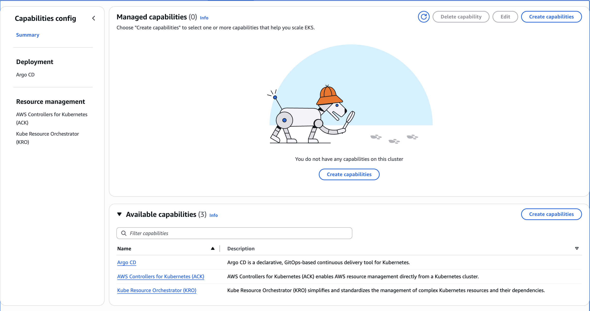

From here, we can click the `Create capabilities` button, and tick the checkbox against Argo CD in the Deployment section, before clicking next.

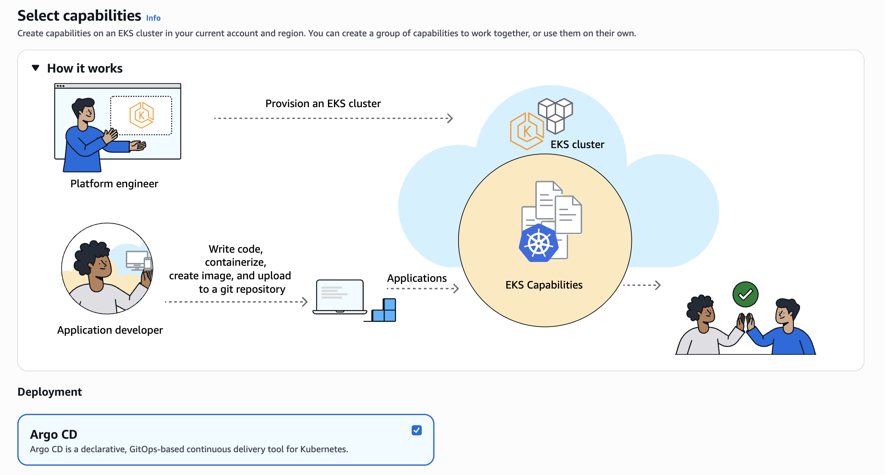

This brings up the page where we configure the selected capabilities. The first thing to do is to either select an existing role for the capability role, or select the button to create a new role.

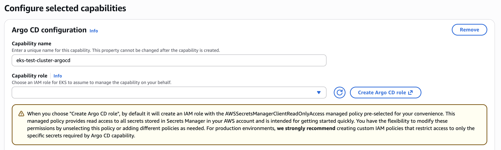

Finally, the Argo CD managed capability integrates with AWS Identity Centre for authentication, and uses RBAC roles for authorization. You select the existing instance of IAM Identity Centre which should be pre-populated when you click the drop down. The next step is to assign RBAC roles. This involves specifying an AWS user or group from AWS Identity Centre and assigning them to an Argo CD RBAC role of "Admin", "Editor" or "Viewer".

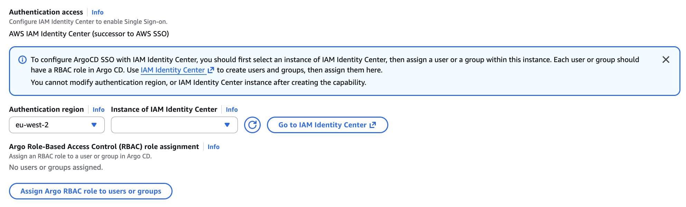

At this point, you can review and create the managed capability for Argo CD. To understand this process in more detail, we can step through how to setup the capability using IaC.


## Setting up Argo CD Capability via IaC and CLI

The code samples required for this section are contained in the `CloudFormation` section of the code repository.

### Create an IAM Capability Role

The first step is to create an IAM Capability Role. EKS Capabilities use this role to act on your behalf, running controllers in EKS. EKS Capabilities introduced a new service principle called `capabilities.eks.amazonaws.com`. When you create the capability role, you need to ensure the trust policy trusts this new service principle. An example of the required trust policy is shown below which is available in a file named "argocd-trust-policy.json":

```yaml
{
    "Version": "2012-10-17",
    "Statement": [
        {
            "Effect": "Allow",
            "Principal": {
                "Service": "capabilities.eks.amazonaws.com"
            },
            "Action": [
                "sts:AssumeRole",
                "sts:TagSession"
            ]
        }
    ]
}
```
We can create an IAM role with this trust policy using the following command:

```bash
aws iam create-role \
  --role-name ArgoCDCapabilityRole \
  --assume-role-policy-document file://argocd-trust-policy.json
```

Next we need to attach permissions to this Capability IAM Role based on the capability needs and what integrations are required. For example, for Argo CD you may need to give permissions to `ecr` or `codecommit` or `codeconnection`, depending on where your source is coming from. When choosing "Create Argo CD role" through the console, an IAM role with the `AWSSecretsManagerClientReadOnlyAccess` managed policy pre-selected is created. This managed policy provides read access to all secrets stored in Secrets Manager in your AWS account and is intended for getting started quickly. You have the flexibility to modify these permissions by unselecting this policy or adding different policies as needed. 

We can this managed policy to the created role by using the following command:

```bash
aws iam attach-role-policy \
  --role-name ArgoCDCapabilityRole \
  --policy-arn arn:aws:iam::aws:policy/AWSSecretsManagerClientReadOnlyAccess
```

We can achieve the same in CloudFormation but in a single template. The `AWS::IAM::Role` config required is shown below, although we will use this as part of the CloudFormation template that creates the EKS Capability, so we can control it in a single stack.

```yaml
  # IAM Capability Role for ArgoCD
  ArgoCDCapabilityRole:
    Type: AWS::IAM::Role
    Properties:
      RoleName: "RoleName"
      AssumeRolePolicyDocument:
        Version: '2012-10-17'
        Statement:
          - Effect: Allow
            Principal:
              Service: capabilities.eks.amazonaws.com
            Action:
              - sts:AssumeRole
              - sts:TagSession
      ManagedPolicyArns:
        - arn:aws:iam::aws:policy/AWSSecretsManagerClientReadOnlyAccess
```

### Create EKS Capability

Finally, we can create the EKS Capability for Argo CD itself. The Argo CD capability is integrated with AWS Identity Centre (IDC). This ensures that single sign-on is enabled for the fully managed and hosted Argo UI instance and for Argo CLI. For this, you need to ensure that your identity centre configuration is passed into the capability when creating it.

The Argo CD IDC instance identifies the name of the IAM Identity Center instance that is used by your organization to get permissions for Argo CD to access your EKS cluster. Once the capability has been created, the Argo CD IDC instance cannot be edited.

We can retrieve the IDC Instance ARN directly from the console, or by running the following command:

```bash
aws sso-admin list-instances --region eu-west-2 --query 'Instances[0].InstanceArn' --output text
```

We need to identify the users or groups that should be assigned to be a particular Argo CD role. The users and groups you identify from your IDC instance defines the permissions that the Argo CD capability has to access your EKS cluster. In the command below I retrieve the User ID for the user called `mattlewis`:

```bash
aws identitystore list-users \
  --region eu-west-2 \
  --identity-store-id $(aws sso-admin list-instances --region eu-west-2 --query 'Instances[0].IdentityStoreId' --output text) \
  --query 'Users[?UserName==`mattlewis`].UserId' --output text
```

If I wanted to assign a Group rather than a User, then I need to retrieve a Group ID from Identity Centre. The following command retrieves the Group ID for a group called `Admin`:

```bash
aws identitystore list-groups \
  --region eu-west-2 \
  --identity-store-id $(aws sso-admin list-instances --region eu-west-2 --query 'Instances[0].IdentityStoreId' --output text) \
  --query 'Groups[?DisplayName==`Admin`].GroupId' \
  --output text
```

There is a JSON file called `aws-identity-centre-configuration.json` which is made available for convenience. The configuration below assigns the User ID to the Argo CD role of `ADMIN`, and the Group ID to the Argo CD role of `VIEWER`.

```json
{
    "argoCd": {
      "awsIdc": {
        "idcInstanceArn": "REPLACE_WITH_IDC_INSTANCE_ARN",
        "idcRegion": "REPLACE_WITH_REGION"
      },
      "rbacRoleMappings": [{
        "role": "ADMIN",
        "identities": [{
          "id": "REPLACE_WITH_USER_ID",
          "type": "SSO_USER"
        }]
      },{
        "role": "VIEWER",
        "identities": [{
          "id": "REPLACE_WITH_GROUP_ID",
          "type": "SSO_GROUP"
        }]
      }
    ]}
  }
```

We can then create the Argo CD capability using the following AWS CLI command:

```shell
aws eks create-capability \
  --capability-name argocd-capability \
  --cluster-name eks-test-cluster\
  --type ARGOCD \
  --role-arn arn:aws:iam::{ACCOUNT_ID}:role/ArgoCDCapabilityRole \
  --delete-propagation-policy RETAIN \
  --configuration file://aws-identity-centre-configuration.json
```

This is equivalent to the following that can be used in a CloudFormation template.

```yaml
ArgoCDCapability:
  Type: AWS::EKS::Capability
  Properties:
    CapabilityName: !Ref CapabilityName
    ClusterName: !Ref ClusterName
    Type: ARGOCD
    RoleArn: !GetAtt ArgoCDCapabilityRole.Arn
    DeletePropagationPolicy: !Ref DeletePropagationPolicy
    Configuration:
      ArgoCd:
        AwsIdc:
          IdcInstanceArn: !Ref IdentityCenterInstanceArn
          IdcRegion: !Ref IdentityCenterRegion
        RbacRoleMappings:
          - Identities:
              - Id: !Ref AdminUserId
                Type: SSO_USER
            Role: ADMIN
          - Identities:
              - Id: !Ref ViewerGroupId
                Type: SSO_GROUP
            Role: VIEWER
```

You can deploy the full CloudFormation stack using the following command:

```bash
aws cloudformation create-stack \
  --stack-name argocd-capability-stack \
  --template-body file://argocd-capability.yaml \
  --parameters \
    ParameterKey=ClusterName,ParameterValue=eks-test-cluster \
    ParameterKey=IdentityCenterInstanceArn,ParameterValue=arn:aws:sso:::instance/ssoins-{REPLACE} \
    ParameterKey=IdentityCenterRegion,ParameterValue=eu-west-2 \
    ParameterKey=AdminUserId,ParameterValue={REPLACE_WITH_USER_ID} \
    ParameterKey=ViewerGroupId,ParameterValue={REPLACE_WITH_GROUP_ID} \
  --capabilities CAPABILITY_NAMED_IAM \
  --region eu-west-2
```

Some of the properties include:

* **Type** - This defines the type of EKS Capability to create with valid values of
  * `ACK` - Amazon Web Services Controllers for Kubernetes (ACK), which lets you manage resources directly from Kubernetes
  * `ARGOCD` – Argo CD for GitOps-based continuous delivery
  * `KRO` – Kube Resource Orchestrator (KRO) for composing and managing custom Kubernetes resources
* **DeletePropagationPolicy** - This only supported value is `RETAIN`, which keeps all resources managed by the capability when the capability is deleted
* **Configuration** - This property defines the configuration settings, with the structure depending on the capability type
* **Role** - The role under the `RbacRoleMappings` property defines the Argo CD role to be assigned. The value values are:
  * `ADMIN` - Full administrative access to Argo CD
  * `EDITOR` - Edit access to Argo CD resources
  * `VIEWER` - Read-only access to Argo CD resources

Once the capability has been created (which will take a while), the capabilities tab for the cluster in the EKS console will provide the Argo API endpoint and a link to go to the managed hosted Argo UI:

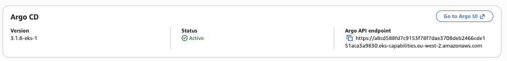

We can click on the link to open up the managed Argo UI. At this point, we will need to click the button to `LOG IN VIA SSO`.

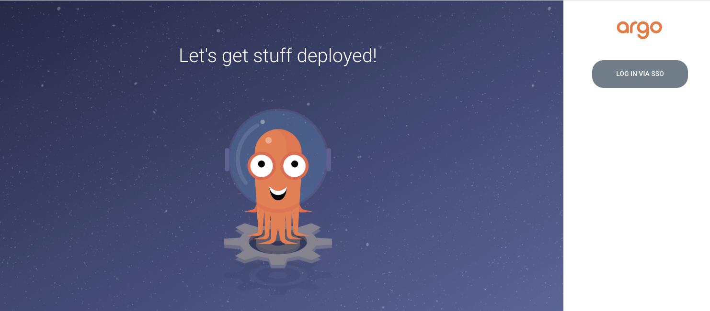

In most cases, this will automatically log you directly into the console. At this point, we can see there are no applications currently available.

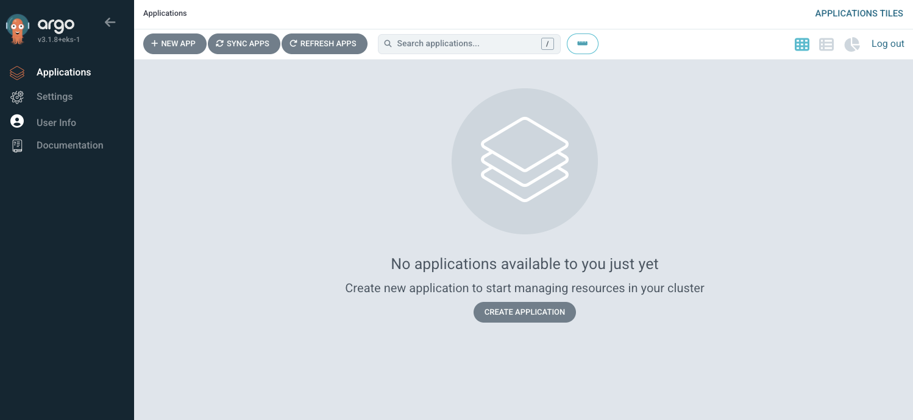

We can also check the Argo CD Role Based Access Control (RCAC) assignments in the console, and make sure that it matches what we set up in the previous JSON file or in the CloudFormation template.


## Argo CD Capability

Now that the Argo CD capability has been created, we can take a quick look at the same of the changes that have been made to our cluster.

Firstly, we run a command to look at the EKS Access Entries for the cluster.

```bash
aws eks list-access-entries \
  --cluster-name eks-test-cluster
```

EKS Access Entries are the recommended way to grant users access to the Kubernetes API. Fundamentally, it associates a set of Kubernetes permissions with an IAM identity such as an IAM Role. Running the command above generated the following output.

```json
{
    "accessEntries": [
        "arn:aws:iam::{ACCOUNT_ID}:role/ArgoCDCapabilityRole",
        "arn:aws:iam::{ACCOUNT_ID}:role/aws-reserved/sso.amazonaws.com/eu-west-2/AWSReservedSSO_Developer_b664db2de4791f77",
        "arn:aws:iam::{ACCOUNT_ID}:role/aws-service-role/eks.amazonaws.com/AWSServiceRoleForAmazonEKS",
        "arn:aws:iam::{ACCOUNT_ID}:role/eks-test-cluster-eks-auto-20260116165710199100000002"
    ]
}
```
We can see that four access entries currently exist in the cluster:

* The SSO Developer role entry, which is the role I assumed to create the EKS cluster
* An EKS Auto Mode generated role that is used to enable Auto Mode to make authenticated Kubernetes API calls
* An EKS service-linked role that is used to manage the control plane and AWS-side resources of the cluster
* The ArgoCDCapabilityRole role entry, which has been created when enabling the Argo CD EKS Capability which allows the capability to authenticate to the cluster

You can see the permissions that have been automatically granted to each entry in the console.

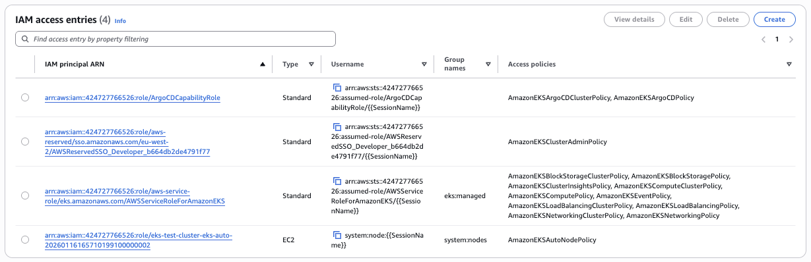

By enabling the EKS Argo CD Capability, the following Custom Resource Definitions (CRDs) have been added to the cluster.

```bash
kubectl get crds | grep argo  

applications.argoproj.io                        2026-01-16T17:10:56Z
applicationsets.argoproj.io                     2026-01-16T17:10:56Z
appprojects.argoproj.io                         2026-01-16T17:10:57Z
```

## Deploy a sample application

### Register your EKS cluster with Argo CD

In order to deploy a sample application, the first step is to register the EKS cluster where we want to deploy an application. We do this by by creating a Kubernetes secret, and passing the label of `argocd.argoproj.io/secret-type: cluster`. We give the cluster a name, and this is where the mapping between the actual cluster and the ARN happens. With EKS Capabilities you only need to provide the ARN and not the Kubernetes API Server URL as with a self-managed instance. In our case, we are registering a local cluster, as it is the same one as Argo CD is running. The following manifest file is found in the code repository under `k8s/argocd`.

```yaml
apiVersion: v1
kind: Secret
metadata:
  name: local-cluster
  namespace: argocd
  labels:
    argocd.argoproj.io/secret-type: cluster
stringData:
  name: local-cluster
  server: arn:aws:eks:eu-west-2:{ACCOUNT_ID}:cluster/eks-test-cluster
  project: default
```

We then apply this to the cluster

```bash
kubectl apply -f local-cluster.yaml
```

### Register an Argo CD Application

Now we can register an Argo CD application. In this case, we will use the guestbook example from the Argo CD project itself.

```yaml
apiVersion: argoproj.io/v1alpha1
kind: Application
metadata:
  name: guestbook
  namespace: argocd
spec:
  project: default
  source:
    repoURL: https://github.com/argoproj/argocd-example-apps
    targetRevision: HEAD
    path: guestbook
  destination:
    server: arn:aws:eks:eu-west-2:{ACCOUNT_ID}:cluster/eks-test-cluster
    namespace: default
```

This is a Kubernetes manifest file for a custom resource (an Argo CD Application). Our cluster knows how to handle this as it has installed the CRD when deploying the capability itself. This application tells Argo CD to deploy the guestbook application from the specific public Git repository into the default namespace of the EKS cluster. We can run this file using the following command.

```bash
kubectl apply -f guestbook-application.yaml
```

We should get back the information that the application has been created `application.argoproj.io/guestbook created`.

At this point we can log in to the Argo UI, and see something similar to the following:

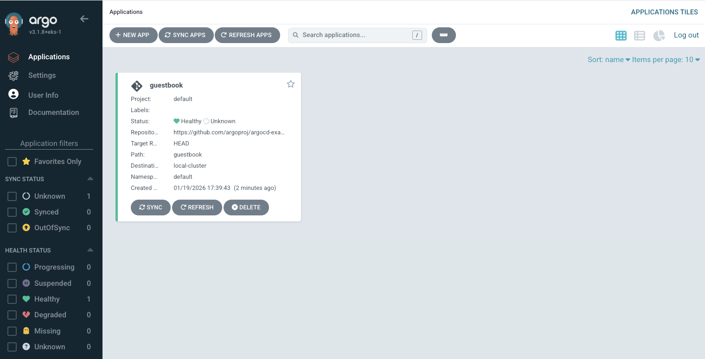

If we go into settings, we can see there is a failed connection status with our cluster.

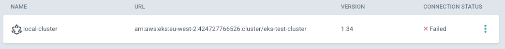

And if we go further and click into the application itself, we see that there are 3 errors in the application conditions.

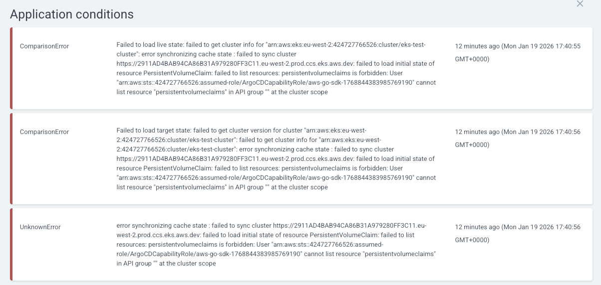

The issue here is that Argo CD cannot build its cache of what exists in the cluster, because it does not have permission to list the cluster-scoped resource `PersistentVolume`. It also cannot list resource "ingressclassparams" in API group "eks.amazonaws.com" at the cluster scope to connect to the cluster.

### Associate an access policy

This issue is caused because the two access policies associated with the Argo CD Capability role (`AmazonEKSArgoCDPolicy` and `AmazonEKSArgoCDClusterPolicy`) do not give the required permissions to access or mutate the cluster resources.

The best practice in this case is to determine the minimum permissions required, and add these to an access policy. However, the fastest solution is to add the `AmazonEKSClusterAdminPolicy` with cluster scope to the access entry, which we can do using the following command:

```bash
aws eks associate-access-policy \
  --cluster-name eks-test-cluster \
  --principal-arn arn:aws:iam::424727766526:role/ArgoCDCapabilityRole \
  --policy-arn arn:aws:eks::aws:cluster-access-policy/AmazonEKSClusterAdminPolicy \
  --access-scope type=cluster
```

Once we have run this command, Argo CD will now be able to connect successfully to the cluster:

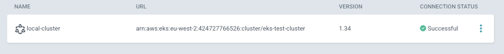

And the application can be synced and is healthy.

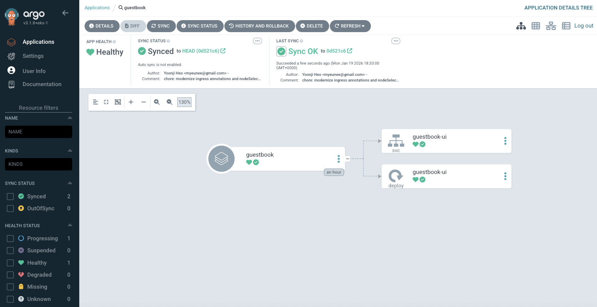

