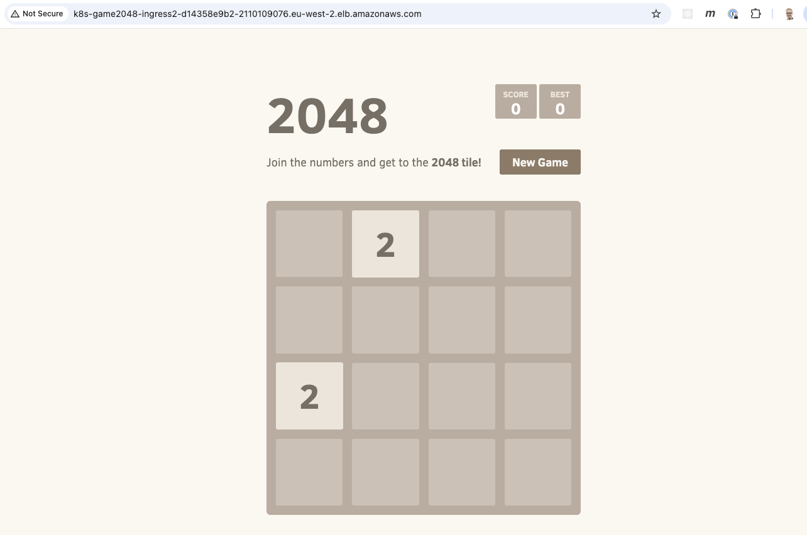
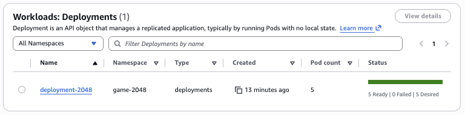
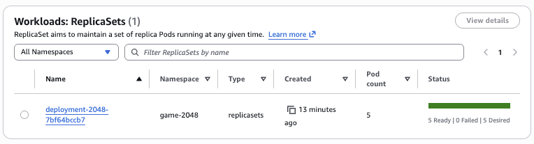
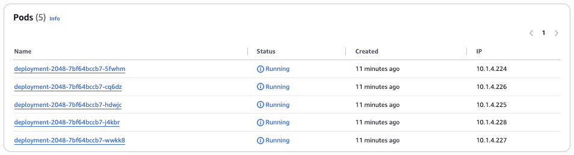
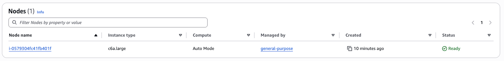
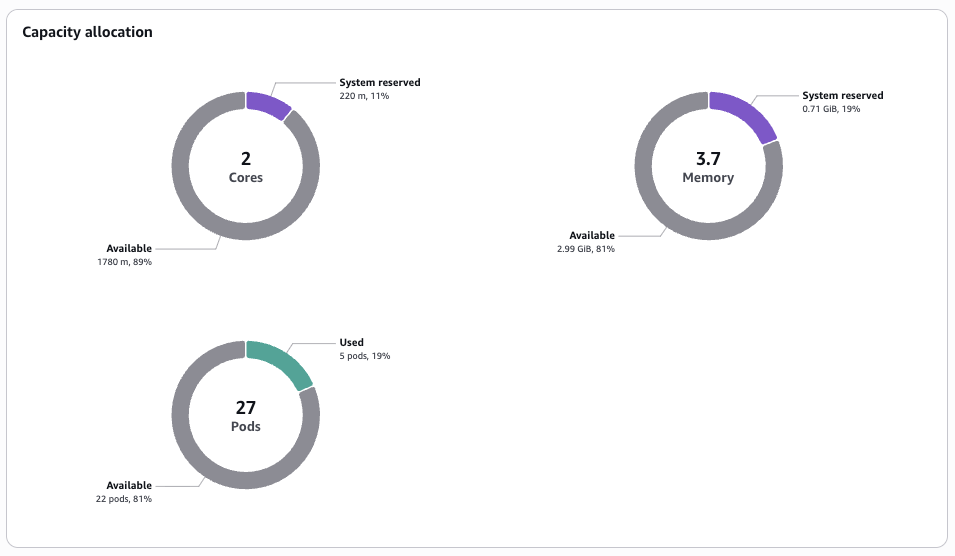

# Deploy First Application

In this section we will deploy the 2048 game sample application and see the cluster in action.

## Create Ingress Class
The first step is to create a Kubernetes `IngressClass`. The IngressClass defines how EKS Auto Mode handles Ingress resources. This step configures the load balancing capability of EKS Auto Mode. When you create Ingress resources for your applications, EKS Auto Mode uses this IngressClass to automatically provision and manage load balancers, integrating your Kubernetes applications with AWS load balancing services.

The `ingressclass.yaml` file can be found in the `./k8s/2048/` folder in the code repository. It declares a cluster-scoped resource that represents an Ingress controller type. The `metadata` section names the IngressClass as `alb` which allows it to be referenced by this name in other specifications. It also marks it as the default IngressClass for the cluster, so any Ingress resource without a `spec.ingressClassName` will be handled by this class. The `spec` section tells Kubernetes that the controller is `eks.amazonaws.com/alb`, which is the controller string used by the AWS Load Balancer Controller.

```yaml
apiVersion: networking.k8s.io/v1
kind: IngressClass
metadata:
  name: alb
  annotations:
    ingressclass.kubernetes.io/is-default-class: "true"
spec:
  controller: eks.amazonaws.com/alb
```

In a terminal window, run the following command to apply this IngressClass to the cluster:

```bash
kubectl apply -f ingressclass.yaml
```

## Setup the 2048 game sample application
A YAML config file is provided that will create/update four resources that together deploy the 2048 web application and expose it to the internet via an AWS ALB. Lets step through each of the resources in turn so we understand it better.

### Create a Namespace
The first resource is a namespace called `game-2048`. A namespace is a logical container for resources. Namespaces provide a mechanism for isolating groups of resources within a single cluster. Names of resources need to be unique within a namespace, but not across namespaces.

```yaml
apiVersion: v1
kind: Namespace
metadata:
  name: game-2048
```

### Create a Deployment
A `Deployment` manages a set of `Pods` to run an application workload. In the template, a Deployment named `deployment-2048` is created in the `game-2048` namespace. The Deployment manages Pods that have the `app.kubernetes.io/name=app-2048` label. It creates a `ReplicaSet`, and its just is to ensure there are exactly 5 Pods running.

The `spec.template` section defines what each Pod should look like. They are a given a label of `app.kubernetes.io/name: app-2048` which matches the Deployment's selector. Each Pod runs one container which exists in the AWS ECR public registry. EKS will always pull the image from the registry before starting the container. The container will be listening on port 80.


```yaml
apiVersion: apps/v1
kind: Deployment
metadata:
  namespace: game-2048
  name: deployment-2048
spec:
  selector:
    matchLabels:
      app.kubernetes.io/name: app-2048
  replicas: 5
  template:
    metadata:
      labels:
        app.kubernetes.io/name: app-2048
    spec:
      containers:
      - image: public.ecr.aws/l6m2t8p7/docker-2048:latest
        imagePullPolicy: Always
        name: app-2048
        ports:
        - containerPort: 80
```

### Create a Service
A `Service` is a method of exposing the application that is running in one or more Pods in your cluster. The `Deployment` defined above will create and destroy Pods dynamically. Pods are considered ephemeral resources. Each Pod gets its own IP address. The Service API, part of Kubernetes, is an abstraction to help you expose groups of Pods over a network.

We create a `Service` called `service-2048` that exists in the `game-2048` namespace. It has a service type of `ClusterIP`. This means that it is allocated a virtual IP and is reachable only from inside the cluster. The `Service` dynamically selects all Pods that have the label `app.kubernetes.io/name: app-2048` which we gave to the Pods in the `Deployment`. The `Service` listens on port 80 and forwards traffic to port 80 on the Pods (the container port in the `Deployment`).


```yaml
apiVersion: v1
kind: Service
metadata:
  name: service-2048
  namespace: game-2048
spec:
  type: ClusterIP
  selector:
    app.kubernetes.io/name: app-2048
  ports:
    - port: 80
      targetPort: 80
```

### Create a Kubernetes Ingress
A Kubernetes Ingress object manages external access to the services in a cluster, typically HTTP.

:::note

The Kubernetes project recommends using `Gateway` instead of `Ingress`. The Ingress API has been frozen, but is still generally available, and the Kubernetes project has no plans to remove Ingress from Kubernetes. However, the Ingress API is no longer being developed, and will have no further changes or updates made to it.

:::

`Ingress` exposes HTTP and HTTPS routes from outside the cluster to services within the cluster. In this case, we create an `Ingress` called `ingress-2048` within the `game-2048` namespace. The annotations tell EKS to create a public Application Load Balancer, and to register the Pod IPs as targets.

In the `spec` section we reference the `alb` `IngressClass` which we created earlier. This ensures requests will be handled by the AWS Load Balancer Controller. This will configure a listener on port 80 with a rule matching path of `/`. It will then create a target group and register the Pod IPs as targets. It will continuously reconcile targets as Pods scale or restart.

```yaml
apiVersion: networking.k8s.io/v1
kind: Ingress
metadata:
  namespace: game-2048
  name: ingress-2048
  annotations:
    alb.ingress.kubernetes.io/scheme: internet-facing
    alb.ingress.kubernetes.io/target-type: ip
spec:
  ingressClassName: alb
  rules:
    - http:
        paths:
        - path: /
          pathType: Prefix
          backend:
            service:
              name: service-2048
              port:
                number: 80
```


## Deploy the 2048 game sample application
To deploy the 2048 game sample application, in the same terminal window run the following command:

```bash
kubectl apply -f 2048_full.yaml
```

This creates/updates four resources that together deploy the 2048 web application and expose it to the internet via an AWS ALB.

### Monitor the Application
To see Auto Mode in action, we can monitor the nodes and pods in separate terminal windows. We can watch the nodes go from `No resources found` to `NotReady` and then `Ready` as the request is made.

```bash
kubectl get nodes -w

NAME                  STATUS     ROLES    AGE   VERSION
i-0579304fc41fb401f   NotReady   <none>   0s    v1.34.2-eks-b3126f4
i-0579304fc41fb401f   Ready      <none>   1s    v1.34.2-eks-b3126f4
```

We can also watch the pods in the `game-2048` namespace go from `Pending` to `ContainerCreating` to `Running` for the 5 pods requested.

```bash
kubectl get pods -n game-2048 -w

NAME                               READY   STATUS    RESTARTS   AGE
deployment-2048-7bf64bccb7-j4kbr   0/1     Pending   0          0s
deployment-2048-7bf64bccb7-5fwhm   0/1     Pending   0          0s
deployment-2048-7bf64bccb7-wwkk8   0/1     Pending   0          0s
deployment-2048-7bf64bccb7-cq6dz   0/1     Pending   0          0s
deployment-2048-7bf64bccb7-hdwjc   0/1     Pending   0          0s
deployment-2048-7bf64bccb7-hdwjc   0/1     ContainerCreating   0          19s
deployment-2048-7bf64bccb7-j4kbr   0/1     ContainerCreating   0          19s
deployment-2048-7bf64bccb7-5fwhm   0/1     ContainerCreating   0          19s
deployment-2048-7bf64bccb7-wwkk8   0/1     ContainerCreating   0          19s
deployment-2048-7bf64bccb7-cq6dz   0/1     ContainerCreating   0          19s
deployment-2048-7bf64bccb7-hdwjc   1/1     Running             0          26s
deployment-2048-7bf64bccb7-j4kbr   1/1     Running             0          26s
deployment-2048-7bf64bccb7-5fwhm   1/1     Running             0          26s
deployment-2048-7bf64bccb7-wwkk8   1/1     Running             0          27s
deployment-2048-7bf64bccb7-cq6dz   1/1     Running             0          27s
```

Next we want to get the ALB configuration for the ingress. We can do this by running the following command.

```bash
kubectl get ingress -n game-2048
```

The response will show the ADDRESS which is the public DNS name of the ALB that has been created.

```bash
NAME           CLASS   HOSTS   ADDRESS                                                                    PORTS   AGE
ingress-2048   alb     *       k8s-game2048-ingress2-d14358e9b2-2110109076.eu-west-2.elb.amazonaws.com   80      31s
```

It will take a few minutes for the load balancer to be provisioned and the listeners and target groups set up. Once complete, you can enter the DNS name into a browser window and start playing the game.



### Check config in the AWS Console
We can also go into the AWS Console and look at what has been setup in the EKS cluster as well as the ALB.

We can click through the Amazon EKS tabs in the console and see the deployment that has been created.



We can see the ReplicaSet created that has a pod count of 5.



We can also view the 5 running pods.



These have all been deployed on a single general purpose node.



The node has an instance type of `c6a.large`. The `c` instance family type is one of the 3 instance family types supported by the `general-purpose` node pool as we saw in a previous section.

Finally, we can see the capacity allocation on that node.




EKS Auto Mode defaults to using prefix delegation (/28 prefixes) for pod networking and maintains a predefined warm pool of IP resources that scales based on the number of scheduled pods. Auto Mode calculates max pods per node based on the number of ENIs and IPs supported per instance type (assuming the worst case of fragmentation).

```bash
aws ec2 describe-instance-types \
  --instance-types c6a.large \
  --query "InstanceTypes[0].NetworkInfo.{MaxENIs:MaximumNetworkInterfaces,Ipv4PerENI:Ipv4AddressesPerInterface}"
```

```json
{
    "MaxENIs": 3,
    "Ipv4PerENI": 10
}
```


### Clean up resources
To remove these resources you can simply delete the `game-2048` namespace, which will remove everything running inside that namespace, using the following command.

```bash
kubectl delete namespace game-2048
```
